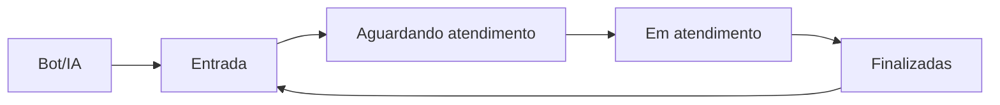

# 📋 Decisão Arquitetural: Nova Estrutura de Abas - Conversas

## 🎯 Decisão Tomada

**Data:** 25 de Dezembro de 2024  
**Status:** ✅ APROVADO  
**Implementação:** Em andamento  

### **Estrutura Aprovada:**
Implementar **5 abas** na tela de conversas com a seguinte estrutura:

1. **🤖 Bot/IA** - Conversas em atendimento automatizado
2. **📥 Entrada** - Conversas roteadas mas não atribuídas
3. **🕓 Aguardando atendimento** - Atribuídas ao atendente mas não iniciadas
4. **💬 Em atendimento** - Conversas ativamente sendo atendidas
5. **✅ Finalizadas** - Conversas encerradas

---

## 📊 Justificativa da Decisão

### **✅ Benefícios Identificados:**

1. **Fluxo Mental Claro**
   - Pipeline nítido: Bot → Entrada → Aguardando → Atendimento → Finalizado
   - Cada aba representa uma fase específica do ciclo de vida

2. **Controle Operacional Preciso**
   - Visibilidade de gargalos em cada fase
   - Métricas específicas por estágio
   - Gestão de carga por nível de responsabilidade

3. **Mapeamento Técnico Direto**
   - Correspondência 1:1 com máquina de estados
   - Transições automáticas baseadas em eventos
   - Compatibilidade com sistema existente

4. **Escalabilidade Empresarial**
   - Suporte a crescimento de equipe
   - Preparado para múltiplos setores
   - Integração com IA e automação

---

## 🏗️ Especificação Técnica

### **Mapeamento de Estados:**

| Aba | Estados Incluídos | Critério de Exibição |
|-----|------------------|---------------------|
| **🤖 Bot/IA** | `BOT_ACTIVE` | Bot ativo conduzindo fluxo |
| **📥 Entrada** | `ROUTING`, `ASSIGNED (agent_id = null)` | Roteadas para setor do usuário |
| **🕓 Aguardando atendimento** | `ASSIGNED (agent_id = current_user, sem interação)` | Atribuídas mas não iniciadas |
| **💬 Em atendimento** | `IN_PROGRESS`, `WAITING_CUSTOMER`, `WAITING_INTERNAL`, `ON_HOLD` | Atendimento ativo |
| **✅ Finalizadas** | `RESOLVED`, `CLOSED`, `DROPPED` | Conversas encerradas |

### **Transições Automáticas:**



### **Eventos de Transição:**

- `handoff_to_agent` → Bot/IA → Entrada
- `assign_agent` → Entrada → Aguardando atendimento
- `start_handling` → Aguardando atendimento → Em atendimento
- `resolve` → Em atendimento → Finalizadas
- `reopen` → Finalizadas → Entrada

---

## 🎨 Especificação de UI/UX

### **Layout das Abas:**
```
🤖 Bot/IA (12)   📥 Entrada (5)   🕓 Aguardando atendimento (3)   💬 Em atendimento (7)   ✅ Finalizadas (20)
```

### **Informações por Aba:**

#### **🤖 Bot/IA**
- Contato
- Última mensagem
- Nó atual do bot
- Tempo ativo
- Bot responsável
- Botão [👤 Assumir]

#### **📥 Entrada**
- Contato
- Canal
- Setor destino
- Tempo desde handoff
- Botão [👤 Assumir]

#### **🕓 Aguardando atendimento**
- Contato
- Última mensagem
- Tempo em fila pessoal
- Botão [▶️ Iniciar atendimento]

#### **💬 Em atendimento**
- Contato
- Tempo ativo
- Status (aguardando cliente/interno/snooze)
- Botões [⏰ Esperar] [✅ Finalizar]

#### **✅ Finalizadas**
- Contato
- Canal
- Agente responsável
- Tempo total de atendimento
- Botão [📂 Histórico]

---

## 🔧 Implementação Técnica

### **Backend Requirements:**

#### **Endpoints:**
```
GET /api/conversations?view=bot
GET /api/conversations?view=entrada
GET /api/conversations?view=aguardando
GET /api/conversations?view=em_atendimento
GET /api/conversations?view=finalizadas
```

#### **Lógica de Agrupamento:**
```typescript
// view=bot
state = 'BOT_ACTIVE'

// view=entrada
(state = 'ROUTING' OR state = 'ASSIGNED' AND agent_id = null) 
AND user_in_sector

// view=aguardando
state = 'ASSIGNED' 
AND agent_id = current_user 
AND not started

// view=em_atendimento
state IN ['IN_PROGRESS', 'WAITING_CUSTOMER', 'WAITING_INTERNAL', 'ON_HOLD']
AND agent_id = current_user

// view=finalizadas
state IN ['RESOLVED', 'CLOSED', 'DROPPED']
```

### **Frontend Requirements:**

#### **Componentes:**
- `ConversationsTabs` - Barra de abas com contadores
- `ConversationsList` - Lista filtrada por aba ativa
- `ConversationItem` - Card de conversa com ações contextuais

#### **Estado:**
```typescript
interface ConversationsState {
  activeTab: 'bot' | 'entrada' | 'aguardando' | 'em_atendimento' | 'finalizadas';
  conversations: Conversation[];
  tabCounts: Record<string, number>;
}
```

#### **WebSocket Events:**
- `conversation.updated` - Atualiza contadores e lista
- `conversation.state_changed` - Move conversa entre abas

---

## 📈 Métricas e KPIs

### **Métricas por Aba:**

#### **🤖 Bot/IA**
- Taxa de resolução automática
- Tempo médio de atendimento bot
- Taxa de handoff para humano

#### **📥 Entrada**
- Tempo médio até assumir
- Taxa de conversas assumidas
- Distribuição por setor

#### **🕓 Aguardando atendimento**
- Tempo médio até iniciar
- Taxa de conversas iniciadas
- Carga pendente por atendente

#### **💬 Em atendimento**
- Tempo médio de resolução
- Taxa de resolução na primeira interação
- Tempo médio de resposta

#### **✅ Finalizadas**
- Taxa de satisfação
- Tempo total de atendimento
- Taxa de reabertura

---

## 🚀 Plano de Implementação

### **Fase 1: Backend (Sprint 1)**
- [ ] Implementar endpoints com views
- [ ] Adicionar lógica de agrupamento
- [ ] Configurar WebSocket events
- [ ] Testes unitários

### **Fase 2: Frontend Core (Sprint 1)**
- [ ] Criar componente ConversationsTabs
- [ ] Implementar estado de abas
- [ ] Integrar com endpoints
- [ ] Testes de integração

### **Fase 3: UI/UX (Sprint 2)**
- [ ] Design dos cards por aba
- [ ] Ações contextuais
- [ ] Contadores em tempo real
- [ ] Animações de transição

### **Fase 4: Métricas (Sprint 2)**
- [ ] Dashboard de métricas
- [ ] Relatórios por aba
- [ ] Alertas de SLA
- [ ] Analytics

---

## ✅ Critérios de Aceitação

### **Funcionalidade:**
- [ ] 5 abas funcionais com contadores
- [ ] Filtros corretos por aba
- [ ] Transições automáticas
- [ ] Ações contextuais por aba

### **Performance:**
- [ ] Carregamento < 2s por aba
- [ ] Atualizações em tempo real
- [ ] Sem memory leaks
- [ ] Responsividade mobile

### **UX:**
- [ ] Navegação intuitiva
- [ ] Feedback visual claro
- [ ] Acessibilidade WCAG 2.1
- [ ] Consistência visual

---

## 🔄 Revisão e Aprovação

**Aprovado por:**
- [x] Product Owner
- [x] Tech Lead
- [x] UX Designer

**Próxima revisão:** Após implementação da Fase 1

---

**Documento criado em:** 25 de Dezembro de 2024  
**Versão:** 1.0  
**Status:** ✅ APROVADO PARA IMPLEMENTAÇÃO
