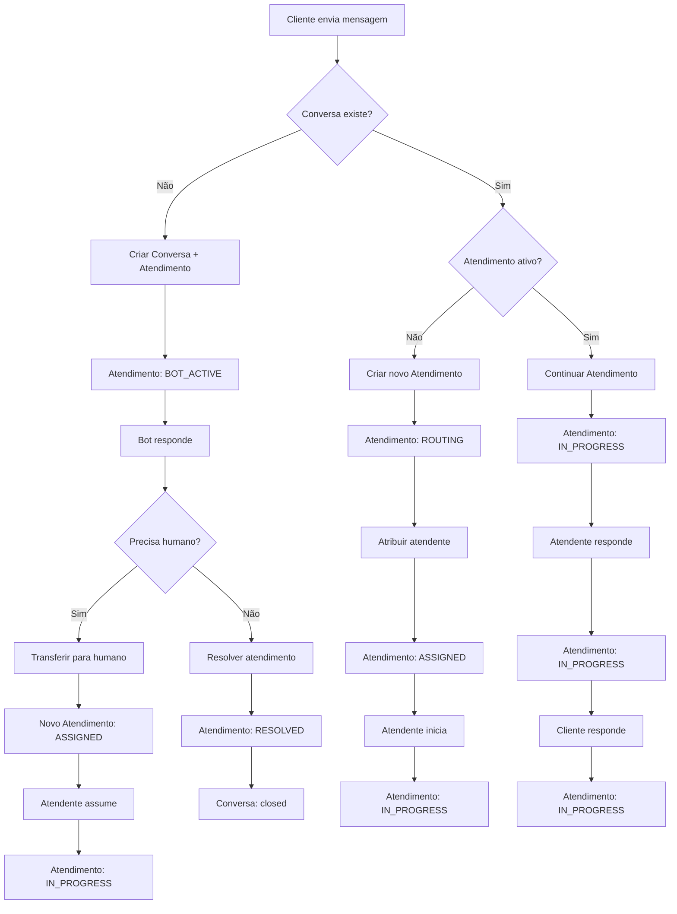

# 🔄 Especificação Revisada - Conversa vs. Atendimento

## 📋 Conceitos Fundamentais

### **Conversa (Conversation)**
- **Definição**: Conjunto de **todas as mensagens** trocadas entre um contato e a clínica
- **Escopo**: Histórico completo e permanente
- **Duração**: Desde o primeiro contato até o presente
- **Estados**: `active`, `closed`, `archived`

### **Atendimento (Session)**
- **Definição**: Conjunto de mensagens de uma conversa em um **período específico de tempo**
- **Escopo**: Sessão específica de atendimento
- **Duração**: Desde o início até o fim de um atendimento
- **Estados**: `BOT_ACTIVE`, `ROUTING`, `ASSIGNED`, `IN_PROGRESS`, etc.

## 🏗️ Arquitetura Proposta

### **Modelo de Dados Atualizado**

```typescript
// CONVERSA - Histórico permanente
interface IConversation extends Document {
  id: string;
  clinic_id: string;
  customer_phone: string;
  customer_name?: string;
  customer_profile_pic?: string;
  
  // Campos para grupos
  conversation_type: 'individual' | 'group';
  group_id?: string;
  group_name?: string;
  
  // Estado geral da conversa
  status: 'active' | 'closed' | 'archived';
  
  // Informações da última mensagem
  last_message?: {
    content: string;
    timestamp: Date;
    sender_type: 'customer' | 'bot' | 'human';
    sender_id?: string;
    sender_name?: string;
  };
  
  // Contadores
  unread_count: number;
  total_messages: number;
  
  // Flags e metadados
  flags: mongoose.Types.ObjectId[];
  tags?: string[];
  
  // Timestamps
  created_at: Date;
  updated_at: Date;
  closed_at?: Date;
  
  // Relacionamento com atendimentos
  current_session_id?: string; // ID do atendimento ativo
  sessions: mongoose.Types.ObjectId[]; // Histórico de atendimentos
}

// ATENDIMENTO - Sessão específica
interface ISession extends Document {
  id: string;
  conversation_id: mongoose.Types.ObjectId; // Referência à conversa
  
  // Estado do atendimento
  state: SessionState;
  
  // Responsável pelo atendimento
  agent_id?: string; // null = IA, string = atendente
  sector_id?: string; // Setor/fila atual
  bot_id?: string; // Bot responsável (se houver)
  
  // Timestamps do atendimento
  started_at: Date;
  ended_at?: Date;
  last_activity_at: Date;
  
  // Contadores específicos do atendimento
  messages_count: number;
  customer_messages_count: number;
  agent_messages_count: number;
  
  // Metadados do atendimento
  resolution_reason?: string;
  satisfaction_score?: number;
  tags?: string[];
  
  // Auditoria
  audit_log: Array<{
    from: SessionState;
    to: SessionState;
    event: string;
    actor: string;
    timestamp: Date;
    metadata?: any;
  }>;
  
  // Timestamps
  created_at: Date;
  updated_at: Date;
}

// Estados do atendimento
enum SessionState {
  NEW = 'NEW',                     // Atendimento criado
  ROUTING = 'ROUTING',             // Sendo roteado
  BOT_ACTIVE = 'BOT_ACTIVE',       // Bot atendendo
  ASSIGNED = 'ASSIGNED',           // Atribuído mas não iniciado
  IN_PROGRESS = 'IN_PROGRESS',     // Atendimento em andamento
  WAITING_CUSTOMER = 'WAITING_CUSTOMER', // Aguardando cliente
  WAITING_INTERNAL = 'WAITING_INTERNAL', // Aguardando interno
  ON_HOLD = 'ON_HOLD',             // Em pausa
  RESOLVED = 'RESOLVED',           // Resolvido
  CLOSED = 'CLOSED',               // Encerrado
  DROPPED = 'DROPPED'              // Encerrado por timeout
}
```

## 🔄 Relacionamento Conversa ↔ Atendimento

### **Cenários de Uso**

#### **1. Primeira Interação**
```
Cliente envia primeira mensagem
↓
Conversa criada (status: active)
↓
Atendimento criado (state: BOT_ACTIVE)
↓
Conversa.current_session_id = Atendimento.id
```

#### **2. Reabertura de Conversa**
```
Cliente reabre conversa fechada
↓
Conversa.status = active
↓
Novo Atendimento criado (state: ROUTING)
↓
Conversa.current_session_id = Novo Atendimento.id
↓
Atendimento anterior mantido no histórico
```

#### **3. Transferência entre Atendentes**
```
Atendente A transfere para Atendente B
↓
Atendimento A.state = CLOSED
↓
Novo Atendimento B criado (state: ASSIGNED)
↓
Conversa.current_session_id = Atendimento B.id
```

## 📊 Mapeamento para Abas da Interface

### **Abas baseadas no ATENDIMENTO ATIVO**

| Aba                           | Filtro Baseado no Atendimento Ativo                    |
| ----------------------------- | ------------------------------------------------------ |
| 🤖 **Bot/IA**                 | `current_session.state = BOT_ACTIVE`                  |
| 📥 **Entrada**                | `current_session.state IN (ROUTING, ASSIGNED) AND current_session.agent_id IS NULL` |
| 🕓 **Aguardando atendimento** | `current_session.state = ASSIGNED AND current_session.agent_id = current_user AND started_at IS NULL` |
| 💬 **Em atendimento**         | `current_session.state IN (IN_PROGRESS, WAITING_CUSTOMER, WAITING_INTERNAL, ON_HOLD) AND current_session.agent_id = current_user` |
| ✅ **Finalizadas**             | `conversation.status = 'closed' OR current_session.state IN (RESOLVED, CLOSED, DROPPED)` |

### **Query SQL Exemplo**

```sql
-- Buscar conversas na aba "Em atendimento"
SELECT c.*, s.*
FROM conversations c
JOIN sessions s ON c.current_session_id = s.id
WHERE c.clinic_id = ?
  AND s.state IN ('IN_PROGRESS', 'WAITING_CUSTOMER', 'WAITING_INTERNAL', 'ON_HOLD')
  AND s.agent_id = ?
  AND c.status = 'active'
ORDER BY s.last_activity_at DESC;
```

## 🔄 Fluxo de Estados

### **Fluxo Principal**



## 📈 Benefícios da Separação

### **1. Histórico Preservado**
- ✅ Conversas mantêm histórico completo
- ✅ Múltiplos atendimentos por conversa
- ✅ Rastreabilidade total

### **2. Métricas Granulares**
- ✅ Tempo por atendimento
- ✅ Performance por sessão
- ✅ Análise de reaberturas

### **3. Flexibilidade Operacional**
- ✅ Transferências entre atendentes
- ✅ Reaberturas de conversas
- ✅ Atendimentos paralelos (futuro)

### **4. Escalabilidade**
- ✅ Suporte a múltiplos canais
- ✅ Integração com diferentes bots
- ✅ Análise de padrões

## 🔧 Implementação Prática

### **Endpoints Atualizados**

```typescript
// GET /api/conversations?view=em_atendimento
// Retorna conversas com atendimentos ativos em progresso
GET /api/conversations?view=em_atendimento&clinic_id={id}

// GET /api/conversations/:id/sessions
// Retorna histórico de atendimentos de uma conversa
GET /api/conversations/{id}/sessions

// POST /api/conversations/:id/sessions
// Criar novo atendimento para uma conversa
POST /api/conversations/{id}/sessions

// PUT /api/sessions/:id/transitions
// Transição de estado do atendimento
PUT /api/sessions/{id}/transitions
```

### **Frontend Atualizado**

```typescript
// Hook para conversas com atendimentos
export const useConversationsWithSessions = (clinicId: string) => {
  const [conversations, setConversations] = useState<ConversationWithSession[]>([]);
  
  const fetchConversations = async (tab: TabKey) => {
    // Buscar conversas com seus atendimentos ativos
    const data = await ConversationsService.getConversationsWithActiveSessions(tab, clinicId);
    setConversations(data);
  };
  
  return { conversations, fetchConversations };
};

// Interface atualizada
interface ConversationWithSession {
  conversation: IConversation;
  activeSession: ISession;
  sessionHistory: ISession[];
}
```

## ✅ Conclusão

A separação entre **Conversa** e **Atendimento** é **fundamental** e deve ser implementada na especificação. Isso permite:

1. **Histórico completo** preservado
2. **Múltiplos atendimentos** por conversa
3. **Métricas granulares** por sessão
4. **Flexibilidade operacional** total
5. **Escalabilidade** futura

**Recomendação**: ✅ **ATUALIZAR** a especificação para incluir essa diferenciação conceitual.
