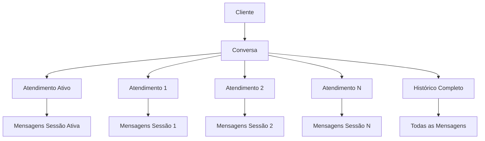
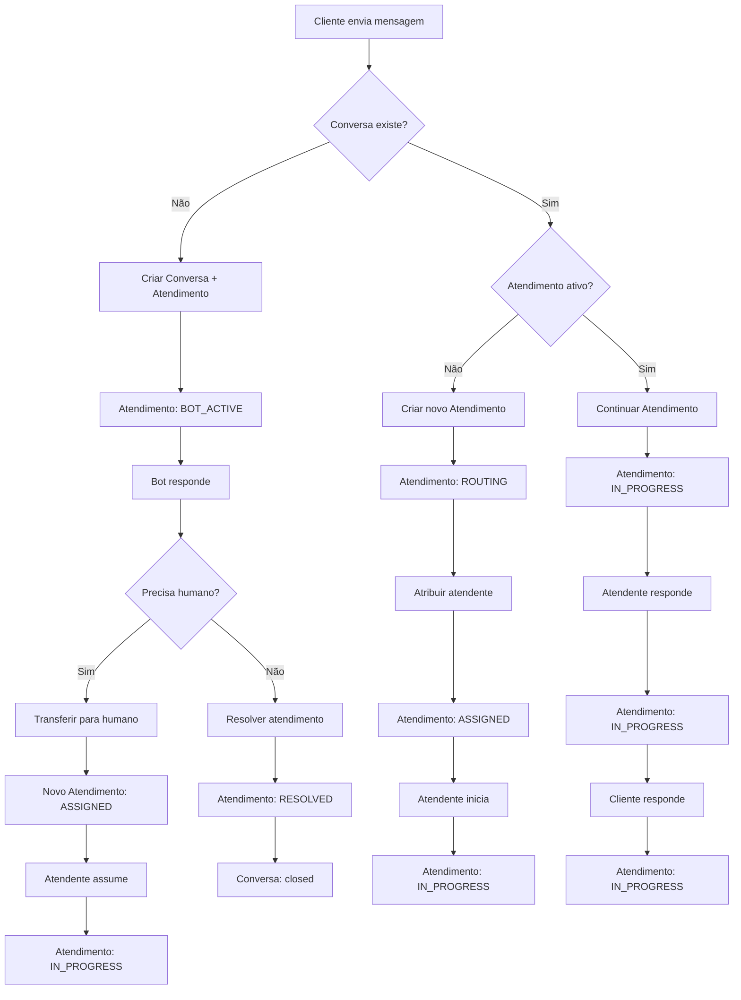

# 🔄 Especificação Atualizada - Sistema de Conversas e Atendimentos

## 📋 Visão Geral

Esta especificação define o sistema de gerenciamento de conversas e atendimentos do AtendeiAi, diferenciando claramente entre **Conversa** (histórico permanente) e **Atendimento** (sessão específica).

## 🏗️ Arquitetura do Sistema

### **Entidades Principais**



### **Conceitos Fundamentais**

#### **Conversa (Conversation)**
- **Definição**: Histórico permanente de todas as mensagens entre um contato e a clínica
- **Escopo**: Relacionamento contínuo e duradouro
- **Estados**: `active`, `closed`, `archived`
- **Características**:
  - Pode ter múltiplos atendimentos ao longo do tempo
  - Mantém histórico completo de interações
  - Identifica unicamente o relacionamento com o cliente

#### **Atendimento (Session)**
- **Definição**: Sessão específica de atendimento em um período determinado
- **Escopo**: Interação limitada no tempo
- **Estados**: `NEW`, `ROUTING`, `BOT_ACTIVE`, `ASSIGNED`, `IN_PROGRESS`, etc.
- **Características**:
  - Período específico de atendimento
  - Estados granulares para controle operacional
  - Métricas específicas por sessão

## 🔄 Estados do Sistema

### **Estados da Conversa**
```typescript
enum ConversationStatus {
  ACTIVE = 'active',     // Conversa ativa
  CLOSED = 'closed',     // Conversa encerrada
  ARCHIVED = 'archived'  // Conversa arquivada
}
```

### **Estados do Atendimento**
```typescript
enum SessionState {
  NEW = 'NEW',                     // Atendimento criado
  ROUTING = 'ROUTING',             // Sendo roteado
  BOT_ACTIVE = 'BOT_ACTIVE',       // Bot atendendo
  ASSIGNED = 'ASSIGNED',           // Atribuído mas não iniciado
  IN_PROGRESS = 'IN_PROGRESS',     // Atendimento em andamento
  WAITING_CUSTOMER = 'WAITING_CUSTOMER', // Aguardando cliente
  WAITING_INTERNAL = 'WAITING_INTERNAL', // Aguardando interno
  ON_HOLD = 'ON_HOLD',             // Em pausa
  RESOLVED = 'RESOLVED',           // Resolvido
  CLOSED = 'CLOSED',               // Encerrado
  DROPPED = 'DROPPED'              // Encerrado por timeout
}
```

## 📊 Mapeamento para Interface

### **Abas da Tela de Conversas**

As abas são baseadas no **atendimento ativo** de cada conversa:

| Aba | Filtro | Descrição |
|-----|--------|-----------|
| 🤖 **Bot/IA** | `current_session.state = BOT_ACTIVE` | Conversas atendidas por bot |
| 📥 **Entrada** | `current_session.state IN (ROUTING, ASSIGNED) AND current_session.agent_id IS NULL` | Conversas aguardando atribuição |
| 🕓 **Aguardando atendimento** | `current_session.state = ASSIGNED AND current_session.agent_id = current_user AND started_at IS NULL` | Conversas atribuídas ao usuário logado mas não iniciadas |
| 💬 **Em atendimento** | `current_session.state IN (IN_PROGRESS, WAITING_CUSTOMER, WAITING_INTERNAL, ON_HOLD) AND current_session.agent_id = current_user` | Conversas em atendimento pelo usuário logado |
| ✅ **Finalizadas** | `conversation.status = 'closed' OR current_session.state IN (RESOLVED, CLOSED, DROPPED)` | Conversas encerradas ou atendimentos finalizados |

## 🔄 Fluxo de Estados

### **Fluxo Principal**



### **Transições de Estado Válidas**

```typescript
const VALID_TRANSITIONS: Record<SessionState, SessionState[]> = {
  [SessionState.NEW]: [SessionState.ROUTING, SessionState.BOT_ACTIVE],
  [SessionState.ROUTING]: [SessionState.BOT_ACTIVE, SessionState.ASSIGNED],
  [SessionState.BOT_ACTIVE]: [SessionState.ASSIGNED, SessionState.RESOLVED, SessionState.CLOSED],
  [SessionState.ASSIGNED]: [SessionState.IN_PROGRESS, SessionState.CLOSED, SessionState.DROPPED],
  [SessionState.IN_PROGRESS]: [SessionState.WAITING_CUSTOMER, SessionState.WAITING_INTERNAL, SessionState.ON_HOLD, SessionState.RESOLVED, SessionState.CLOSED],
  [SessionState.WAITING_CUSTOMER]: [SessionState.IN_PROGRESS, SessionState.CLOSED, SessionState.DROPPED],
  [SessionState.WAITING_INTERNAL]: [SessionState.IN_PROGRESS, SessionState.CLOSED],
  [SessionState.ON_HOLD]: [SessionState.IN_PROGRESS, SessionState.CLOSED],
  [SessionState.RESOLVED]: [SessionState.CLOSED],
  [SessionState.CLOSED]: [],
  [SessionState.DROPPED]: []
};
```

## 🏗️ Modelo de Dados

### **Conversa (Conversation)**
```typescript
interface IConversation extends Document {
  id: string;
  clinic_id: string;
  customer_phone: string;
  customer_name?: string;
  customer_profile_pic?: string;
  
  // Campos para grupos
  conversation_type: 'individual' | 'group';
  conversation_subtype?: 'newsletter' | 'regular';
  group_id?: string;
  group_name?: string;
  last_participant_id?: string;
  last_participant_name?: string;
  
  // Estado geral da conversa
  status: 'active' | 'closed' | 'archived';
  
  // Referência ao atendimento ativo
  current_session_id?: string;
  sessions: mongoose.Types.ObjectId[];
  
  // Informações da última mensagem
  last_message?: {
    content: string;
    timestamp: Date;
    sender_type: 'customer' | 'bot' | 'human';
    sender_id?: string;
    sender_name?: string;
  };
  
  // Contadores
  unread_count: number;
  total_messages: number;
  total_sessions_count: number;
  
  // Flags e metadados
  flags: mongoose.Types.ObjectId[];
  tags?: string[];
  
  // Timestamps
  created_at: Date;
  updated_at: Date;
  closed_at?: Date;
  last_session_ended_at?: Date;
}
```

### **Atendimento (Session)**
```typescript
interface ISession extends Document {
  id: string;
  conversation_id: mongoose.Types.ObjectId;
  
  // Estado do atendimento
  state: SessionState;
  
  // Responsável pelo atendimento
  agent_id?: string; // null = IA, string = atendente
  sector_id?: string; // Setor/fila atual
  bot_id?: string; // Bot responsável (se houver)
  
  // Timestamps do atendimento
  started_at: Date;
  ended_at?: Date;
  last_activity_at: Date;
  
  // Contadores específicos do atendimento
  messages_count: number;
  customer_messages_count: number;
  agent_messages_count: number;
  
  // Metadados do atendimento
  resolution_reason?: string;
  satisfaction_score?: number;
  tags?: string[];
  
  // Auditoria
  audit_log: Array<{
    from: SessionState;
    to: SessionState;
    event: string;
    actor: string;
    timestamp: Date;
    metadata?: any;
  }>;
  
  // Timestamps
  created_at: Date;
  updated_at: Date;
}
```

### **Transição de Estado (SessionTransition)**
```typescript
interface ISessionTransition extends Document {
  session_id: mongoose.Types.ObjectId;
  from_state: SessionState;
  to_state: SessionState;
  event: string;
  actor: string;
  timestamp: Date;
  metadata?: any;
}
```

## 🔄 Regras de Negócio

### **Criação de Atendimentos**
1. **Nova conversa**: Cria conversa + primeiro atendimento
2. **Reabertura**: Cria novo atendimento para conversa existente
3. **Transferência**: Encerra atendimento atual + cria novo atendimento

### **Transições de Estado**
1. **Validação**: Apenas transições válidas são permitidas
2. **Auditoria**: Todas as transições são registradas
3. **Notificações**: Mudanças de estado notificam stakeholders

### **Encerramento de Atendimentos**
1. **Resolução**: Atendimento resolvido com sucesso
2. **Timeout**: Atendimento encerrado por inatividade
3. **Transferência**: Atendimento encerrado para transferir

## 📊 Métricas e KPIs

### **Métricas por Atendimento**
- Duração do atendimento
- Número de mensagens trocadas
- Tempo de resposta médio
- Taxa de resolução
- Satisfação do cliente

### **Métricas por Conversa**
- Número total de atendimentos
- Duração total do relacionamento
- Frequência de reaberturas
- Satisfação média
- Valor do cliente

### **Métricas por Agente**
- Número de atendimentos realizados
- Tempo médio de atendimento
- Taxa de resolução
- Satisfação média dos clientes
- Produtividade

## 🔧 APIs e Endpoints

### **Endpoints de Conversa**
```typescript
// GET /api/conversations?view={tab}&clinic_id={id}
// Retorna conversas com atendimentos ativos filtrados por aba
GET /api/conversations?view=em_atendimento&clinic_id=123

// GET /api/conversations/:id
// Retorna detalhes de uma conversa específica
GET /api/conversations/456

// GET /api/conversations/:id/sessions
// Retorna histórico de atendimentos de uma conversa
GET /api/conversations/456/sessions

// PUT /api/conversations/:id/close
// Encerra uma conversa
PUT /api/conversations/456/close
```

### **Endpoints de Atendimento**
```typescript
// POST /api/sessions
// Cria novo atendimento
POST /api/sessions
{
  "conversation_id": "456",
  "initial_state": "BOT_ACTIVE"
}

// GET /api/sessions/:id
// Retorna detalhes de um atendimento
GET /api/sessions/789

// PUT /api/sessions/:id/transitions
// Transição de estado do atendimento
PUT /api/sessions/789/transitions
{
  "to_state": "IN_PROGRESS",
  "actor": "user_123"
}

// PUT /api/sessions/:id/assign
// Atribui atendimento a um agente
PUT /api/sessions/789/assign
{
  "agent_id": "agent_456"
}

// PUT /api/sessions/:id/transfer
// Transfere atendimento para outro agente
PUT /api/sessions/789/transfer
{
  "target_agent_id": "agent_789"
}

// PUT /api/sessions/:id/close
// Encerra um atendimento
PUT /api/sessions/789/close
{
  "reason": "resolved",
  "satisfaction_score": 5
}
```

## 🔄 Integração Frontend-Backend

### **Hooks Customizados**
```typescript
// Hook para conversas com atendimentos
export const useConversationsWithSessions = (clinicId: string) => {
  const [conversations, setConversations] = useState<ConversationWithSession[]>([]);
  const [loading, setLoading] = useState(false);
  
  const fetchConversations = useCallback(async (view: string) => {
    setLoading(true);
    try {
      const data = await ConversationService.getConversationsWithActiveSessions(view, clinicId);
      setConversations(data);
    } finally {
      setLoading(false);
    }
  }, [clinicId]);
  
  return { conversations, loading, fetchConversations };
};

// Hook para gerenciar sessões
export const useSessions = (conversationId: string) => {
  const [sessions, setSessions] = useState<Session[]>([]);
  const [activeSession, setActiveSession] = useState<Session | null>(null);
  const [loading, setLoading] = useState(false);
  
  const createSession = useCallback(async (initialState: SessionState) => {
    // Implementar criação de sessão
  }, [conversationId]);
  
  const transitionSession = useCallback(async (sessionId: string, toState: SessionState) => {
    // Implementar transição de estado
  }, []);
  
  return {
    sessions,
    activeSession,
    loading,
    createSession,
    transitionSession
  };
};
```

### **Componentes Principais**
```typescript
// Card de conversa com informações do atendimento ativo
interface ConversationCardProps {
  conversation: ConversationWithSession;
  onAssign?: (sessionId: string) => void;
  onTransfer?: (sessionId: string) => void;
  onClose?: (sessionId: string) => void;
}

// Drawer de histórico de atendimentos
interface SessionHistoryDrawerProps {
  open: boolean;
  onClose: () => void;
  conversationId: string;
}

// Modal de transição de estado
interface SessionTransitionModalProps {
  open: boolean;
  onClose: () => void;
  session: Session;
  onTransition: (toState: SessionState) => void;
}
```

## 🚀 Implementação

### **Fases de Desenvolvimento**
1. **Backend**: Modelos, serviços e controllers
2. **Frontend**: Tipos, serviços e hooks
3. **Integração**: Componentes e páginas
4. **Testes**: Validação e refinamento

### **Critérios de Aceitação**
- ✅ Conversas mantêm histórico permanente
- ✅ Múltiplos atendimentos por conversa
- ✅ Transições de estado funcionais
- ✅ Abas baseadas em atendimento ativo
- ✅ Métricas granulares por sessão
- ✅ Interface intuitiva e responsiva
- ✅ Performance otimizada
- ✅ Tratamento robusto de erros

## 🎯 Conclusão

Esta especificação atualizada diferencia claramente entre **Conversa** e **Atendimento**, permitindo:

1. **Histórico completo** preservado
2. **Múltiplos atendimentos** por conversa
3. **Métricas granulares** por sessão
4. **Flexibilidade operacional** total
5. **Escalabilidade** futura

A implementação seguirá o plano detalhado em `plano-implementacao-conversa-atendimento.md`.
