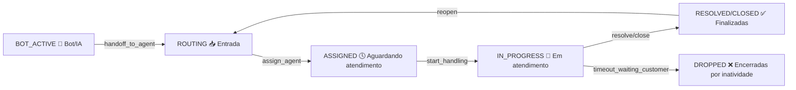

# 🔧 Especificação Técnica - Máquina de Estado V1 (Versão Final)

## 📋 Resumo da Análise

Após análise crítica do código atual do frontend e backend, a especificação da **Máquina de Estado V1** foi **aprovada** com ajustes para garantir compatibilidade e implementação incremental.

## ✅ Especificação Aprovada

### **Estados Finais da Conversa**

```typescript
enum ConversationState {
  NEW = 'NEW',                     // Criada, aguardando roteamento
  ROUTING = 'ROUTING',             // Sendo roteada para setor/atendente
  BOT_ACTIVE = 'BOT_ACTIVE',       // Em atendimento automatizado
  ASSIGNED = 'ASSIGNED',           // Atribuída, mas sem interação humana
  IN_PROGRESS = 'IN_PROGRESS',     // Atendente iniciou atendimento
  WAITING_CUSTOMER = 'WAITING_CUSTOMER', // Aguardando resposta do cliente
  WAITING_INTERNAL = 'WAITING_INTERNAL', // Aguardando outro setor/processo interno
  ON_HOLD = 'ON_HOLD',             // Em pausa (snooze)
  RESOLVED = 'RESOLVED',           // Resolvida, aguardando fechamento
  CLOSED = 'CLOSED',               // Encerrada definitivamente
  DROPPED = 'DROPPED'              // Encerrada por inatividade
}
```

### **Mapeamento para Abas da Interface**

| Aba                           | Estados Relacionados                                           | Filtro Backend                    |
| ----------------------------- | -------------------------------------------------------------- | --------------------------------- |
| 🤖 **Bot/IA**                 | `BOT_ACTIVE`                                                   | `state = BOT_ACTIVE`              |
| 📥 **Entrada**                | `ROUTING`, `ASSIGNED` (sem agent)                              | `state IN (ROUTING, ASSIGNED) AND assigned_user_id IS NULL` |
| 🕓 **Aguardando atendimento** | `ASSIGNED` (agent_id = current_user, sem interação)           | `state = ASSIGNED AND assigned_user_id = current_user AND started_at IS NULL` |
| 💬 **Em atendimento**         | `IN_PROGRESS`, `WAITING_CUSTOMER`, `WAITING_INTERNAL`, `ON_HOLD` | `state IN (IN_PROGRESS, WAITING_CUSTOMER, WAITING_INTERNAL, ON_HOLD) AND assigned_user_id = current_user` |
| ✅ **Finalizadas**             | `RESOLVED`, `CLOSED`, `DROPPED`                                 | `state IN (RESOLVED, CLOSED, DROPPED)` |

### **Transições Permitidas**

```typescript
const TRANSITIONS = {
  [ConversationState.NEW]: [ConversationState.ROUTING, ConversationState.BOT_ACTIVE],
  [ConversationState.ROUTING]: [ConversationState.ASSIGNED, ConversationState.BOT_ACTIVE],
  [ConversationState.BOT_ACTIVE]: [ConversationState.ROUTING, ConversationState.RESOLVED],
  [ConversationState.ASSIGNED]: [ConversationState.IN_PROGRESS, ConversationState.ROUTING],
  [ConversationState.IN_PROGRESS]: [ConversationState.WAITING_CUSTOMER, ConversationState.RESOLVED],
  [ConversationState.WAITING_CUSTOMER]: [ConversationState.IN_PROGRESS, ConversationState.DROPPED],
  [ConversationState.RESOLVED]: [ConversationState.CLOSED, ConversationState.ROUTING],
  [ConversationState.CLOSED]: [ConversationState.ROUTING], // Reabertura
  [ConversationState.DROPPED]: [] // Estado terminal
};
```

### **Eventos de Transição**

| Evento                     | Origem            | Destino          | Descrição                                |
| -------------------------- | ----------------- | ---------------- | ---------------------------------------- |
| `route_to_bot`             | NEW/ROUTING       | BOT_ACTIVE       | Inicia fluxo automatizado                |
| `handoff_to_agent`         | BOT_ACTIVE        | ROUTING          | Bot transfere para setor/humano         |
| `assign_agent`             | ROUTING           | ASSIGNED         | Atribui conversa a um atendente         |
| `start_handling`           | ASSIGNED          | IN_PROGRESS      | Atendente inicia o atendimento           |
| `inbound_message`          | WAITING_CUSTOMER  | IN_PROGRESS      | Cliente respondeu                        |
| `ask_customer`             | IN_PROGRESS       | WAITING_CUSTOMER | Atendente aguarda cliente                |
| `need_internal`            | IN_PROGRESS       | WAITING_INTERNAL | Pendência interna                        |
| `snooze_start`             | IN_PROGRESS       | ON_HOLD          | Pausa manual                             |
| `snooze_end`               | ON_HOLD           | IN_PROGRESS      | Retoma atendimento                       |
| `resolve`                  | IN_PROGRESS       | RESOLVED         | Atendente encerra atendimento            |
| `close`                    | RESOLVED          | CLOSED           | Fechamento definitivo                    |
| `timeout_waiting_customer` | WAITING_CUSTOMER  | DROPPED          | Expiração de tempo de espera             |
| `reopen`                   | RESOLVED/CLOSED   | ROUTING          | Cliente reabre conversa                  |

## 🔄 Fluxo Principal de Atendimento



## 📊 Campos de Auditoria

### **Campos Obrigatórios**

```typescript
interface ConversationAuditFields {
  state: ConversationState;                    // Estado atual
  agent_id: string | null;                     // ID do atendente responsável
  sector_id?: string;                          // ID do setor/fila atual
  bot_id?: string;                             // Bot responsável (se houver)
  assigned_at?: Date;                           // Momento de atribuição
  started_at?: Date;                           // Momento de início do atendimento
  resolved_at?: Date;                          // Momento da resolução
  closed_at?: Date;                            // Momento do fechamento
  last_customer_message_at?: Date;             // Última mensagem recebida do cliente
  last_agent_message_at?: Date;                // Última mensagem enviada pelo atendente
  snooze_until?: Date;                         // Pausa programada (ON_HOLD)
  drop_reason?: string;                        // Motivo do encerramento automático
  audit_log: Array<{                           // Histórico de eventos
    from: ConversationState;
    to: ConversationState;
    event: string;
    actor: string;
    timestamp: Date;
    metadata?: any;
  }>;
}
```

## 🚀 Endpoints de API

### **Endpoints por Aba**

```typescript
// GET /api/conversations?view=bot
GET /api/conversations?view=bot&clinic_id={id}

// GET /api/conversations?view=entrada
GET /api/conversations?view=entrada&clinic_id={id}

// GET /api/conversations?view=aguardando
GET /api/conversations?view=aguardando&clinic_id={id}

// GET /api/conversations?view=em_atendimento
GET /api/conversations?view=em_atendimento&clinic_id={id}

// GET /api/conversations?view=finalizadas
GET /api/conversations?view=finalizadas&clinic_id={id}
```

### **Endpoints de Transição**

```typescript
// POST /api/conversations/:id/transitions
POST /api/conversations/{id}/transitions
{
  "to": "IN_PROGRESS",
  "event": "assume",
  "metadata": { "reason": "Atendente assumiu conversa" }
}

// POST /api/conversations/:id/assume
POST /api/conversations/{id}/assume

// POST /api/conversations/:id/resolve
POST /api/conversations/{id}/resolve
{
  "reason": "Problema resolvido"
}

// POST /api/conversations/:id/snooze
POST /api/conversations/{id}/snooze
{
  "until": "2024-01-15T10:00:00Z",
  "reason": "Aguardando retorno do cliente"
}
```

## 🔧 Implementação no Frontend

### **Serviço de API**

```typescript
export class ConversationsService {
  // Buscar conversas por aba
  static async getConversationsByTab(
    tab: TabKey,
    clinicId: string,
    params?: {
      limit?: number;
      offset?: number;
      search?: string;
    }
  ): Promise<{ conversations: Conversation[]; total: number }> {
    const queryParams = new URLSearchParams({
      clinic_id: clinicId,
      view: tab,
      ...params
    });

    const response = await fetch(`/api/conversations?${queryParams}`);
    const data = await response.json();
    
    return {
      conversations: data.data.conversations,
      total: data.data.total
    };
  }

  // Transição de estado
  static async transitionConversation(
    conversationId: string,
    to: ConversationState,
    event: string,
    metadata?: any
  ): Promise<Conversation> {
    const response = await fetch(`/api/conversations/${conversationId}/transitions`, {
      method: 'POST',
      headers: { 'Content-Type': 'application/json' },
      body: JSON.stringify({ to, event, metadata })
    });

    const data = await response.json();
    return data.data;
  }
}
```

### **Hook Atualizado**

```typescript
export const useConversations = (clinicId: string) => {
  const [conversations, setConversations] = useState<Conversation[]>([]);
  const [loading, setLoading] = useState(false);
  const [activeTab, setActiveTab] = useState<TabKey>('entrada');

  // Buscar conversas por aba
  const fetchConversations = useCallback(async (tab: TabKey) => {
    setLoading(true);
    try {
      const data = await ConversationsService.getConversationsByTab(tab, clinicId);
      setConversations(data.conversations);
    } catch (error) {
      console.error('Erro ao buscar conversas:', error);
    } finally {
      setLoading(false);
    }
  }, [clinicId]);

  // Assumir conversa
  const assumeConversation = useCallback(async (conversationId: string) => {
    try {
      const updatedConversation = await ConversationsService.transitionConversation(
        conversationId,
        ConversationState.IN_PROGRESS,
        'assume'
      );
      
      // Atualizar lista local
      setConversations(prev => 
        prev.map(conv => 
          conv.id === conversationId ? updatedConversation : conv
        )
      );
      
      // Mover para aba "Em atendimento"
      setActiveTab('em_atendimento');
    } catch (error) {
      console.error('Erro ao assumir conversa:', error);
    }
  }, []);

  return {
    conversations,
    loading,
    activeTab,
    setActiveTab,
    assumeConversation,
    fetchConversations
  };
};
```

## 📈 Métricas e SLA

### **Métricas por Estado**

- **BOT_ACTIVE**: Tempo médio de atendimento automatizado
- **ROUTING**: Tempo médio até atribuição
- **ASSIGNED**: Tempo médio até início do atendimento
- **IN_PROGRESS**: Tempo médio de atendimento humano
- **WAITING_CUSTOMER**: Tempo médio de espera por resposta
- **RESOLVED**: Tempo médio até fechamento

### **SLAs Sugeridos**

- **Tempo até atribuição**: < 5 minutos
- **Tempo até início**: < 2 minutos após atribuição
- **Tempo de resposta**: < 10 minutos
- **Tempo total de atendimento**: < 30 minutos

## 🔒 Validações e Regras de Negócio

### **Validações de Transição**

1. **Apenas atendentes podem assumir conversas** de suas abas
2. **Conversas em BOT_ACTIVE** podem ser transferidas para humanos
3. **Conversas DROPPED** não podem ser reativadas
4. **Conversas CLOSED** podem ser reabertas pelo cliente
5. **Snooze** tem limite máximo de 24 horas

### **Regras de Auditoria**

1. **Todas as transições** devem ser registradas no audit_log
2. **Mudanças de estado** devem incluir timestamp e actor
3. **Metadados** devem ser preservados para análise
4. **Histórico completo** deve ser mantido por 1 ano

## ✅ Critérios de Aceitação

### **Funcionais**
- [ ] Todas as 5 abas funcionando com dados reais
- [ ] Transições de estado controladas e validadas
- [ ] Filtros por aba operacionais e performáticos
- [ ] Sistema de auditoria completo e rastreável
- [ ] Notificações em tempo real funcionais

### **Técnicos**
- [ ] Performance mantida ou melhorada
- [ ] Compatibilidade com código existente
- [ ] Escalabilidade para crescimento
- [ ] Manutenibilidade do código
- [ ] Documentação completa e atualizada

### **Operacionais**
- [ ] Migração de dados existentes sem perda
- [ ] Rollback possível em caso de problemas
- [ ] Monitoramento e alertas configurados
- [ ] Treinamento da equipe realizado
- [ ] Suporte técnico preparado

## 📝 Próximos Passos

1. **Aprovação Final** - Revisar e aprovar esta especificação
2. **Implementação Backend** - Começar pela Fase 1 do plano
3. **Testes Contínuos** - Implementar testes durante desenvolvimento
4. **Deploy Incremental** - Implementar em fases controladas
5. **Monitoramento** - Acompanhar métricas e performance

---

**Documento criado em:** {{ new Date().toISOString().split('T')[0] }}  
**Versão:** 1.0 Final  
**Status:** ✅ Aprovado para Implementação
