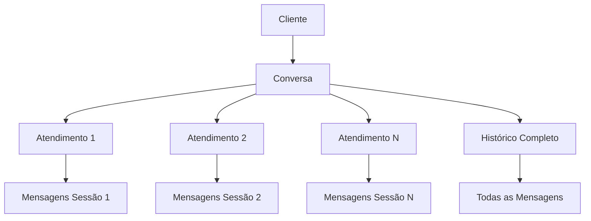

# 🚀 Plano de Implementação - Conversa vs. Atendimento

## 📋 Visão Geral

Este documento define o plano completo de implementação da distinção entre **Conversa** (histórico permanente) e **Atendimento** (sessão específica) no sistema AtendeiAi.

## 🏗️ Arquitetura Geral

### **Entidades Principais**



### **Relacionamentos**

- **1 Conversa** → **N Atendimentos**
- **1 Atendimento** → **N Mensagens** (período específico)
- **1 Conversa** → **1 Atendimento Ativo** (current_session_id)

## 🔄 Fases de Implementação

### **Fase 1: Backend - Modelos e Schemas** ⏱️ 2-3 dias

#### **1.1 Criar Modelo Session**
```typescript
// src/models/Session.ts
export interface ISession extends Document {
  id: string;
  conversation_id: mongoose.Types.ObjectId;
  state: SessionState;
  agent_id?: string;
  sector_id?: string;
  bot_id?: string;
  
  // Timestamps
  started_at: Date;
  ended_at?: Date;
  last_activity_at: Date;
  
  // Contadores
  messages_count: number;
  customer_messages_count: number;
  agent_messages_count: number;
  
  // Metadados
  resolution_reason?: string;
  satisfaction_score?: number;
  tags?: string[];
  
  // Auditoria
  audit_log: Array<{
    from: SessionState;
    to: SessionState;
    event: string;
    actor: string;
    timestamp: Date;
    metadata?: any;
  }>;
  
  created_at: Date;
  updated_at: Date;
}

export enum SessionState {
  NEW = 'NEW',
  ROUTING = 'ROUTING',
  BOT_ACTIVE = 'BOT_ACTIVE',
  ASSIGNED = 'ASSIGNED',
  IN_PROGRESS = 'IN_PROGRESS',
  WAITING_CUSTOMER = 'WAITING_CUSTOMER',
  WAITING_INTERNAL = 'WAITING_INTERNAL',
  ON_HOLD = 'ON_HOLD',
  RESOLVED = 'RESOLVED',
  CLOSED = 'CLOSED',
  DROPPED = 'DROPPED'
}
```

#### **1.2 Atualizar Modelo Conversation**
```typescript
// src/models/Conversation.ts - Adicionar campos
export interface IConversation extends Document {
  // ... campos existentes ...
  
  // Novos campos para sessões
  current_session_id?: string;
  sessions: mongoose.Types.ObjectId[];
  total_sessions_count: number;
  
  // Campos de métricas
  total_messages: number;
  last_session_ended_at?: Date;
}
```

#### **1.3 Criar Modelo SessionTransition**
```typescript
// src/models/SessionTransition.ts
export interface ISessionTransition extends Document {
  session_id: mongoose.Types.ObjectId;
  from_state: SessionState;
  to_state: SessionState;
  event: string;
  actor: string;
  timestamp: Date;
  metadata?: any;
}
```

### **Fase 2: Backend - Serviços e Controllers** ⏱️ 3-4 dias

#### **2.1 SessionService**
```typescript
// src/services/SessionService.ts
export class SessionService {
  async createSession(conversationId: string, initialState: SessionState): Promise<ISession>
  async getActiveSession(conversationId: string): Promise<ISession | null>
  async transitionSession(sessionId: string, toState: SessionState, actor: string): Promise<ISession>
  async getSessionHistory(conversationId: string): Promise<ISession[]>
  async closeSession(sessionId: string, reason: string): Promise<ISession>
  async assignSession(sessionId: string, agentId: string): Promise<ISession>
  async transferSession(sessionId: string, targetAgentId: string): Promise<ISession>
}
```

#### **2.2 ConversationService Atualizado**
```typescript
// src/services/ConversationService.ts - Adicionar métodos
export class ConversationService {
  // ... métodos existentes ...
  
  async getConversationsWithActiveSessions(view: string, clinicId: string): Promise<ConversationWithSession[]>
  async createNewSession(conversationId: string): Promise<ISession>
  async getSessionHistory(conversationId: string): Promise<ISession[]>
  async getConversationMetrics(conversationId: string): Promise<ConversationMetrics>
}
```

#### **2.3 SessionController**
```typescript
// src/controllers/SessionController.ts
export class SessionController {
  async createSession(req: Request, res: Response): Promise<void>
  async getActiveSession(req: Request, res: Response): Promise<void>
  async transitionSession(req: Request, res: Response): Promise<void>
  async getSessionHistory(req: Request, res: Response): Promise<void>
  async closeSession(req: Request, res: Response): Promise<void>
  async assignSession(req: Request, res: Response): Promise<void>
  async transferSession(req: Request, res: Response): Promise<void>
}
```

### **Fase 3: Backend - Rotas e Middleware** ⏱️ 1-2 dias

#### **3.1 Rotas de Sessão**
```typescript
// src/routes/sessions.ts
router.post('/sessions', SessionController.createSession);
router.get('/sessions/:id', SessionController.getActiveSession);
router.put('/sessions/:id/transitions', SessionController.transitionSession);
router.get('/conversations/:id/sessions', SessionController.getSessionHistory);
router.put('/sessions/:id/close', SessionController.closeSession);
router.put('/sessions/:id/assign', SessionController.assignSession);
router.put('/sessions/:id/transfer', SessionController.transferSession);
```

#### **3.2 Middleware de Validação**
```typescript
// src/middleware/sessionValidation.ts
export const validateSessionTransition = (req: Request, res: Response, next: NextFunction) => {
  // Validar transições de estado válidas
  // Validar permissões do usuário
  // Validar dados de entrada
};
```

### **Fase 4: Frontend - Tipos e Interfaces** ⏱️ 1 dia

#### **4.1 Tipos TypeScript**
```typescript
// src/types/session.ts
export interface Session {
  id: string;
  conversationId: string;
  state: SessionState;
  agentId?: string;
  sectorId?: string;
  botId?: string;
  startedAt: Date;
  endedAt?: Date;
  lastActivityAt: Date;
  messagesCount: number;
  customerMessagesCount: number;
  agentMessagesCount: number;
  resolutionReason?: string;
  satisfactionScore?: number;
  tags?: string[];
  auditLog: SessionTransition[];
  createdAt: Date;
  updatedAt: Date;
}

export interface SessionTransition {
  from: SessionState;
  to: SessionState;
  event: string;
  actor: string;
  timestamp: Date;
  metadata?: any;
}

export interface ConversationWithSession {
  conversation: Conversation;
  activeSession?: Session;
  sessionHistory: Session[];
}

export interface ConversationMetrics {
  totalSessions: number;
  totalMessages: number;
  averageSessionDuration: number;
  resolutionRate: number;
  satisfactionAverage: number;
}
```

#### **4.2 Enums e Constantes**
```typescript
// src/constants/sessionStates.ts
export const SESSION_STATES = {
  NEW: 'NEW',
  ROUTING: 'ROUTING',
  BOT_ACTIVE: 'BOT_ACTIVE',
  ASSIGNED: 'ASSIGNED',
  IN_PROGRESS: 'IN_PROGRESS',
  WAITING_CUSTOMER: 'WAITING_CUSTOMER',
  WAITING_INTERNAL: 'WAITING_INTERNAL',
  ON_HOLD: 'ON_HOLD',
  RESOLVED: 'RESOLVED',
  CLOSED: 'CLOSED',
  DROPPED: 'DROPPED'
} as const;

export const SESSION_STATE_LABELS = {
  [SESSION_STATES.NEW]: 'Novo',
  [SESSION_STATES.ROUTING]: 'Roteando',
  [SESSION_STATES.BOT_ACTIVE]: 'Bot Ativo',
  [SESSION_STATES.ASSIGNED]: 'Atribuído',
  [SESSION_STATES.IN_PROGRESS]: 'Em Andamento',
  [SESSION_STATES.WAITING_CUSTOMER]: 'Aguardando Cliente',
  [SESSION_STATES.WAITING_INTERNAL]: 'Aguardando Interno',
  [SESSION_STATES.ON_HOLD]: 'Em Pausa',
  [SESSION_STATES.RESOLVED]: 'Resolvido',
  [SESSION_STATES.CLOSED]: 'Encerrado',
  [SESSION_STATES.DROPPED]: 'Encerrado por Timeout'
} as const;
```

### **Fase 5: Frontend - Serviços e Hooks** ⏱️ 2-3 dias

#### **5.1 SessionService**
```typescript
// src/services/sessionService.ts
export class SessionService {
  async createSession(conversationId: string, initialState: SessionState): Promise<Session>
  async getActiveSession(conversationId: string): Promise<Session | null>
  async transitionSession(sessionId: string, toState: SessionState, actor: string): Promise<Session>
  async getSessionHistory(conversationId: string): Promise<Session[]>
  async closeSession(sessionId: string, reason: string): Promise<Session>
  async assignSession(sessionId: string, agentId: string): Promise<Session>
  async transferSession(sessionId: string, targetAgentId: string): Promise<Session>
}
```

#### **5.2 ConversationService Atualizado**
```typescript
// src/services/conversationService.ts - Adicionar métodos
export class ConversationService {
  // ... métodos existentes ...
  
  async getConversationsWithActiveSessions(view: string, clinicId: string): Promise<ConversationWithSession[]>
  async getConversationMetrics(conversationId: string): Promise<ConversationMetrics>
  async getSessionHistory(conversationId: string): Promise<Session[]>
}
```

#### **5.3 Hooks Customizados**
```typescript
// src/hooks/useSessions.ts
export const useSessions = (conversationId: string) => {
  const [sessions, setSessions] = useState<Session[]>([]);
  const [activeSession, setActiveSession] = useState<Session | null>(null);
  const [loading, setLoading] = useState(false);
  
  const createSession = useCallback(async (initialState: SessionState) => {
    // Implementar criação de sessão
  }, [conversationId]);
  
  const transitionSession = useCallback(async (sessionId: string, toState: SessionState) => {
    // Implementar transição de estado
  }, []);
  
  return {
    sessions,
    activeSession,
    loading,
    createSession,
    transitionSession
  };
};

// src/hooks/useConversationsWithSessions.ts
export const useConversationsWithSessions = (clinicId: string) => {
  const [conversations, setConversations] = useState<ConversationWithSession[]>([]);
  const [loading, setLoading] = useState(false);
  
  const fetchConversations = useCallback(async (view: string) => {
    setLoading(true);
    try {
      const data = await ConversationService.getConversationsWithActiveSessions(view, clinicId);
      setConversations(data);
    } finally {
      setLoading(false);
    }
  }, [clinicId]);
  
  return { conversations, loading, fetchConversations };
};
```

### **Fase 6: Frontend - Componentes Atualizados** ⏱️ 3-4 dias

#### **6.1 ConversationCard Atualizado**
```typescript
// src/components/ConversationCard.tsx
interface ConversationCardProps {
  conversation: ConversationWithSession;
  onAssign?: (sessionId: string) => void;
  onTransfer?: (sessionId: string) => void;
  onClose?: (sessionId: string) => void;
}

export const ConversationCard: React.FC<ConversationCardProps> = ({
  conversation,
  onAssign,
  onTransfer,
  onClose
}) => {
  const { conversation: conv, activeSession } = conversation;
  
  return (
    <Card className="p-4">
      {/* Informações da conversa */}
      <div className="flex items-center gap-3">
        <Avatar src={conv.customerProfilePic} />
        <div>
          <h3 className="font-semibold">{conv.customerName}</h3>
          <p className="text-sm text-gray-600">{conv.customerPhone}</p>
        </div>
      </div>
      
      {/* Estado do atendimento ativo */}
      {activeSession && (
        <div className="mt-3">
          <Badge variant={getSessionStateVariant(activeSession.state)}>
            {SESSION_STATE_LABELS[activeSession.state]}
          </Badge>
          <p className="text-sm text-gray-600 mt-1">
            {activeSession.agentId ? `Atendente: ${activeSession.agentId}` : 'Bot'}
          </p>
        </div>
      )}
      
      {/* Ações contextuais */}
      <div className="mt-4 flex gap-2">
        {activeSession && (
          <>
            <Button size="sm" onClick={() => onAssign?.(activeSession.id)}>
              Atribuir
            </Button>
            <Button size="sm" variant="outline" onClick={() => onTransfer?.(activeSession.id)}>
              Transferir
            </Button>
            <Button size="sm" variant="destructive" onClick={() => onClose?.(activeSession.id)}>
              Encerrar
            </Button>
          </>
        )}
      </div>
    </Card>
  );
};
```

#### **6.2 SessionHistoryDrawer**
```typescript
// src/components/SessionHistoryDrawer.tsx
export const SessionHistoryDrawer: React.FC<{
  open: boolean;
  onClose: () => void;
  conversationId: string;
}> = ({ open, onClose, conversationId }) => {
  const { sessions, loading } = useSessions(conversationId);
  
  return (
    <Drawer open={open} onClose={onClose}>
      <DrawerContent>
        <DrawerHeader>
          <DrawerTitle>Histórico de Atendimentos</DrawerTitle>
        </DrawerHeader>
        
        <DrawerBody>
          {loading ? (
            <div className="flex justify-center py-8">
              <Spinner />
            </div>
          ) : (
            <div className="space-y-4">
              {sessions.map((session) => (
                <SessionCard key={session.id} session={session} />
              ))}
            </div>
          )}
        </DrawerBody>
      </DrawerContent>
    </Drawer>
  );
};
```

#### **6.3 SessionTransitionModal**
```typescript
// src/components/SessionTransitionModal.tsx
export const SessionTransitionModal: React.FC<{
  open: boolean;
  onClose: () => void;
  session: Session;
  onTransition: (toState: SessionState) => void;
}> = ({ open, onClose, session, onTransition }) => {
  const [selectedState, setSelectedState] = useState<SessionState | null>(null);
  
  const availableTransitions = getAvailableTransitions(session.state);
  
  return (
    <Dialog open={open} onOpenChange={onClose}>
      <DialogContent>
        <DialogHeader>
          <DialogTitle>Transição de Estado</DialogTitle>
          <DialogDescription>
            Atual estado: {SESSION_STATE_LABELS[session.state]}
          </DialogDescription>
        </DialogHeader>
        
        <div className="space-y-4">
          <Label>Novo Estado</Label>
          <Select value={selectedState || ''} onValueChange={(value) => setSelectedState(value as SessionState)}>
            <SelectTrigger>
              <SelectValue placeholder="Selecione o novo estado" />
            </SelectTrigger>
            <SelectContent>
              {availableTransitions.map((state) => (
                <SelectItem key={state} value={state}>
                  {SESSION_STATE_LABELS[state]}
                </SelectItem>
              ))}
            </SelectContent>
          </Select>
        </div>
        
        <DialogFooter>
          <Button variant="outline" onClick={onClose}>
            Cancelar
          </Button>
          <Button 
            onClick={() => selectedState && onTransition(selectedState)}
            disabled={!selectedState}
          >
            Confirmar
          </Button>
        </DialogFooter>
      </DialogContent>
    </Dialog>
  );
};
```

### **Fase 7: Frontend - Páginas Atualizadas** ⏱️ 2-3 dias

#### **7.1 ConversationsList Atualizado**
```typescript
// src/pages/Conversations/components/ConversationsList/ConversationsList.tsx
export const ConversationsList: React.FC<{
  view: string;
  clinicId: string;
}> = ({ view, clinicId }) => {
  const { conversations, loading, fetchConversations } = useConversationsWithSessions(clinicId);
  const [selectedConversation, setSelectedConversation] = useState<string | null>(null);
  
  useEffect(() => {
    fetchConversations(view);
  }, [view, fetchConversations]);
  
  const handleAssign = async (sessionId: string) => {
    // Implementar atribuição
  };
  
  const handleTransfer = async (sessionId: string) => {
    // Implementar transferência
  };
  
  const handleClose = async (sessionId: string) => {
    // Implementar encerramento
  };
  
  return (
    <div className="space-y-4">
      {loading ? (
        <div className="flex justify-center py-8">
          <Spinner />
        </div>
      ) : (
        conversations.map((conversation) => (
          <ConversationCard
            key={conversation.conversation.id}
            conversation={conversation}
            onAssign={handleAssign}
            onTransfer={handleTransfer}
            onClose={handleClose}
          />
        ))
      )}
    </div>
  );
};
```

#### **7.2 ConversationDetail Atualizado**
```typescript
// src/pages/Conversations/components/ConversationDetail/ConversationDetail.tsx
export const ConversationDetail: React.FC<{
  conversationId: string;
}> = ({ conversationId }) => {
  const { activeSession, sessions } = useSessions(conversationId);
  const [showSessionHistory, setShowSessionHistory] = useState(false);
  
  return (
    <div className="h-full flex flex-col">
      {/* Header com informações da sessão ativa */}
      <div className="border-b p-4">
        <div className="flex items-center justify-between">
          <div>
            <h2 className="text-lg font-semibold">Detalhes da Conversa</h2>
            {activeSession && (
              <div className="flex items-center gap-2 mt-2">
                <Badge variant={getSessionStateVariant(activeSession.state)}>
                  {SESSION_STATE_LABELS[activeSession.state]}
                </Badge>
                <span className="text-sm text-gray-600">
                  {activeSession.agentId ? `Atendente: ${activeSession.agentId}` : 'Bot'}
                </span>
              </div>
            )}
          </div>
          
          <Button
            variant="outline"
            onClick={() => setShowSessionHistory(true)}
          >
            Histórico
          </Button>
        </div>
      </div>
      
      {/* Conteúdo da conversa */}
      <div className="flex-1 overflow-auto">
        {/* Mensagens da sessão ativa */}
        {activeSession && (
          <MessagesList sessionId={activeSession.id} />
        )}
      </div>
      
      {/* Drawer de histórico */}
      <SessionHistoryDrawer
        open={showSessionHistory}
        onClose={() => setShowSessionHistory(false)}
        conversationId={conversationId}
      />
    </div>
  );
};
```

### **Fase 8: Integração e Testes** ⏱️ 2-3 dias

#### **8.1 Testes de Integração**
```typescript
// src/tests/integration/session.test.ts
describe('Session Integration', () => {
  test('should create session when conversation starts', async () => {
    // Testar criação de sessão
  });
  
  test('should transition session states correctly', async () => {
    // Testar transições de estado
  });
  
  test('should maintain conversation history across sessions', async () => {
    // Testar histórico entre sessões
  });
});
```

#### **8.2 Testes de Componentes**
```typescript
// src/tests/components/ConversationCard.test.tsx
describe('ConversationCard', () => {
  test('should display active session information', () => {
    // Testar exibição de sessão ativa
  });
  
  test('should handle session actions', () => {
    // Testar ações de sessão
  });
});
```

## 🔧 Configurações e Migrações

### **Migração de Dados**
```typescript
// scripts/migrate-conversations-to-sessions.ts
export const migrateConversationsToSessions = async () => {
  // 1. Criar sessões para conversas ativas
  // 2. Migrar dados de atendimento para sessões
  // 3. Atualizar referências
  // 4. Validar integridade
};
```

### **Configurações de Ambiente**
```typescript
// src/config/session.ts
export const SESSION_CONFIG = {
  MAX_SESSION_DURATION: 24 * 60 * 60 * 1000, // 24 horas
  AUTO_CLOSE_TIMEOUT: 30 * 60 * 1000, // 30 minutos
  MAX_CONCURRENT_SESSIONS: 10,
  SESSION_CLEANUP_INTERVAL: 60 * 60 * 1000 // 1 hora
};
```

## 📊 Métricas e Monitoramento

### **Métricas de Sessão**
```typescript
// src/services/SessionMetricsService.ts
export class SessionMetricsService {
  async getSessionMetrics(clinicId: string, period: string): Promise<SessionMetrics>
  async getAgentPerformance(agentId: string, period: string): Promise<AgentMetrics>
  async getSectorPerformance(sectorId: string, period: string): Promise<SectorMetrics>
  async getResolutionRate(clinicId: string, period: string): Promise<number>
  async getAverageSessionDuration(clinicId: string, period: string): Promise<number>
}
```

### **Dashboard de Métricas**
```typescript
// src/components/SessionMetricsDashboard.tsx
export const SessionMetricsDashboard: React.FC<{
  clinicId: string;
  period: string;
}> = ({ clinicId, period }) => {
  const { metrics, loading } = useSessionMetrics(clinicId, period);
  
  return (
    <div className="grid grid-cols-1 md:grid-cols-2 lg:grid-cols-4 gap-4">
      <MetricCard
        title="Sessões Ativas"
        value={metrics.activeSessions}
        trend={metrics.activeSessionsTrend}
      />
      <MetricCard
        title="Taxa de Resolução"
        value={`${metrics.resolutionRate}%`}
        trend={metrics.resolutionRateTrend}
      />
      <MetricCard
        title="Duração Média"
        value={formatDuration(metrics.averageDuration)}
        trend={metrics.averageDurationTrend}
      />
      <MetricCard
        title="Satisfação"
        value={`${metrics.satisfactionAverage}/5`}
        trend={metrics.satisfactionTrend}
      />
    </div>
  );
};
```

## 🚀 Cronograma de Implementação

### **Semana 1: Backend Foundation**
- ✅ **Dia 1-2**: Modelos e Schemas
- ✅ **Dia 3-4**: Serviços e Controllers
- ✅ **Dia 5**: Rotas e Middleware

### **Semana 2: Frontend Foundation**
- ✅ **Dia 1**: Tipos e Interfaces
- ✅ **Dia 2-3**: Serviços e Hooks
- ✅ **Dia 4-5**: Componentes Base

### **Semana 3: Integração e Testes**
- ✅ **Dia 1-2**: Páginas Atualizadas
- ✅ **Dia 3-4**: Integração e Testes
- ✅ **Dia 5**: Deploy e Validação

### **Semana 4: Refinamento**
- ✅ **Dia 1-2**: Métricas e Dashboard
- ✅ **Dia 3-4**: Otimizações
- ✅ **Dia 5**: Documentação Final

## ✅ Critérios de Aceitação

### **Funcionalidades Core**
- [ ] ✅ Conversas mantêm histórico permanente
- [ ] ✅ Múltiplos atendimentos por conversa
- [ ] ✅ Transições de estado funcionais
- [ ] ✅ Abas baseadas em atendimento ativo
- [ ] ✅ Métricas granulares por sessão

### **Performance**
- [ ] ✅ Queries otimizadas para sessões
- [ ] ✅ Índices adequados no MongoDB
- [ ] ✅ Cache de sessões ativas
- [ ] ✅ Paginação eficiente

### **UX/UI**
- [ ] ✅ Interface intuitiva para sessões
- [ ] ✅ Feedback visual de estados
- [ ] ✅ Ações contextuais funcionais
- [ ] ✅ Histórico acessível

### **Integração**
- [ ] ✅ Backend e Frontend sincronizados
- [ ] ✅ WebSocket para atualizações em tempo real
- [ ] ✅ Validações de estado consistentes
- [ ] ✅ Tratamento de erros robusto

## 🎯 Conclusão

Este plano de implementação garante uma transição suave e estruturada para a arquitetura de **Conversa vs. Atendimento**, mantendo a funcionalidade existente enquanto adiciona a flexibilidade e granularidade necessárias para um sistema de atendimento profissional.

**Próximo passo**: Iniciar a **Fase 1** com a criação dos modelos e schemas no backend.
